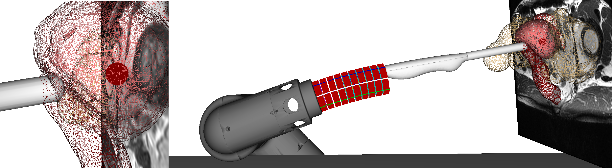

# Planning of Soft-Rigid Hybrid Arms in Contact With Compliant Environment

[](https://inria.hal.science/hal-03729071)
[](https://youtu.be/5-wpNLITPKQ?feature=shared)

In this work, a rigid robot is hybridized with a soft part to improve its properties of relative positioning and safe interaction. While the design of the device is quite simple, the kinematics, on the other hand, becomes complex. Pre-operative planning of such a robot is a challenge that is faced in this work. The clinical context is the automation of transrectal prostate biopsy: a robot is connected to a thin ultrasound (US) probe instrumented with a needle through a flexible silicone part. The procedure consists of: moving the probe near the prostate through the rectum, aligning the probe with identified lesions in the prostate, and shooting the needle to collect tissue samples. In this repository you will find the simulations showing the feasibility of our methods to solve the planning of the entire procedure.

<body>

</body>

## Requirements

- [SOFA](https://github.com/sofa-framework/sofa) on branch master

Here are the requirements to run the simulations of the probe's insertion and alignment. If you are interested in the simulation of the robot alone, skip the next section.

### 1. Needle insertion

Download the following plugins for SOFA:

- [STLIB](https://github.com/SofaDefrost/STLIB)
- [BeamAdapter](https://github.com/sofa-framework/BeamAdapter) plugin on branch master

Requirements' and other plugins dependency (to enable in CMake GUI):

- SofaPython3, SofaImplicitField, SofaDistanceGrid plugins

### 2. Robot

Download the following plugin for SOFA:

- [SoftRobots](https://github.com/SofaDefrost/SoftRobots)
- [SoftRobots.Inverse](https://github.com/SofaDefrost/SoftRobots.Inverse) plugin used to solve the inverse kinematics of the robot. The plugin is also distributed with [SOFA binaries](https://github.com/sofa-framework/sofa/releases).
If you want to try the simulations without SoftRobots.Inverse set `INVERSE=False` in the corresponding python scene file.

Requirements' and other plugins dependency (to enable in CMake GUI):

- SofaPython3 and ArticulatedSystem plugins

This version is using Python3. Additional python libraries are required for the robot's controller interface:

`python -m pip install --user python-tk`

## How to

To run the complete simulation, launch SOFA and load the file _scene.py_. Or in a terminal:

`runSofa scene.py`

If you want to change the patient datas or change the tissues' mechanical behavior, you can access the parameters in _scripts/SceneParams.py_. Detailed descriptions of the parameters are given in the same file.
To try the robot alone, launch SOFA and load the file _scripts/Robot.py_. Or in a terminal:

`runSofa scripts/Robot.py`

## More information

- **data** : meshes used in simulation.
- **scripts** : parts composing the complete simulation. Each script contains a test scene that can be launched with SOFA.

## Authors

Eulalie Coevoet, Meichun Lin

## Bibtex

```
@article{coevoet2022,
  author={Coevoet, Eulalie and Adagolodjo, Yinoussa and Lin, Meichun and Duriez, Christian and Ficuciello, Fanny},
  journal={IEEE Robotics and Automation Letters}, 
  title={Planning of Soft-Rigid Hybrid Arms in Contact With Compliant Environment: Application to the Transrectal Biopsy of the Prostate}, 
  year={2022},
  volume={7},
  number={2},
  pages={4853-4860},
  doi={10.1109/LRA.2022.3152322}}
```

## Collaboration

Collaboration repository with the university of Federico II (Italy), ICAROS center.

<body>

</body>

